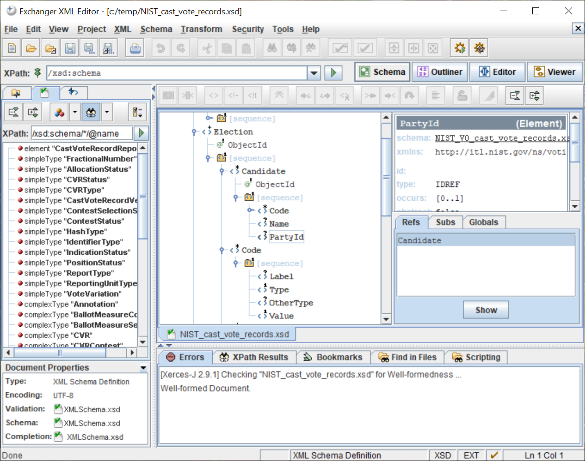

# ExchangerXML

The Exchanger XML Editor is a multi platform XML Editor currently. The Editor facilitates easy editing, browsing, managing and conversion of XML Documents.

The Exchanger XML Editor is a Java-based product that provides functionality for viewing, authoring and editing XML data and documents. The Exchanger XML Editor offers a broad spectrum of functionality to help XML authors, business analysts and software developers.

It features XML Schema, RelaxNG and DTD based editing, tag prompting and validation, Grid view for tag free editing, XPath and regular expression searches, schema conversion, XSLT, XQUERY and XSLFO transformations, comprehensive project management, an SVG viewer and conversion, easy SOAP invocations, and more.

## License

Licensed under [Artistic License/GPL](https://dev.perl.org/licenses/)